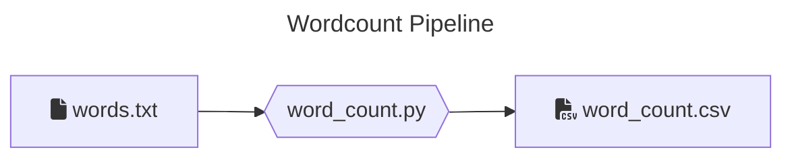
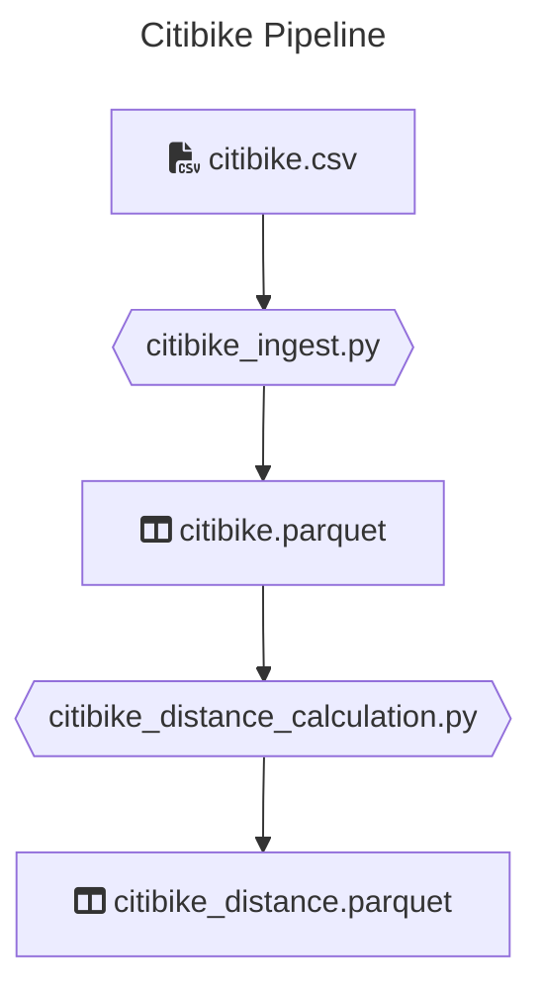

# Data transformations with Python

This coding challenge is a collection of _Python_ jobs that are supposed to extract, transform and load data.
These jobs are using _PySpark_ to process larger volumes of data and are supposed to run on a _Spark_ cluster (via `spark-submit`).

## Preparing for the interview

> [!WARNING]
> The exercises will be given at the time of interview, and **solved by pairing with the interviewer**.  
> Please do not solve the exercises before the interview.

**✅ Goals:**

1. **Get a [working environment set up](#setup-the-environment).** You can setup a [local environment](#option-1-local-setup), use a [devcontainer](#option-2-devcontainer-setup) or use [Github codespaces](#option-3-github-codespaces).
2. 2. **Get a high-level understanding of the code and test dataset structure**
3. Have your preferred text editor or IDE setup and ready to go.
4. ⚠️ Don't solve the exercises before the interview. ⚠️

## Setup the environment
### Option 1: Local Setup

> [!TIP]
> Use the [Devcontainer setup](#option-2-devcontainer-setup-github-codespaces) if you encounter issues.

#### Pre-requisites

Please make sure you have the following installed and can run them

- Python (3.13.X), you can use for example [pyenv](https://github.com/pyenv/pyenv#installation) to manage your python versions locally
- [Poetry](https://python-poetry.org/docs/#installation)
- Java (17), you can use [sdkman](https://sdkman.io/) to install and manage java locally

#### Windows users

We recommend using WSL 2 on Windows for this exercise, due to the [lack of support](https://cwiki.apache.org/confluence/display/HADOOP2/WindowsProblems) of windows paths from Hadoop/Spark.

Follow instructions on the [Windows official page](https://learn.microsoft.com/en-us/windows/wsl/setup/environment) and then the linux install.  
Use the [Devcontainer setup](#option-2-devcontainer-setup) if you encounter issues.

#### Install all dependencies

```bash
poetry install
```

### Option 2: Devcontainer setup - Github codespaces

Configuration to use dev containers is provided in `.devcontainer`

> [!WARNING]
> This takes up to 7 minutes to setup, make sure to have things running before the interview.

1. [Fork](https://github.com/techops-recsys-lateral-hiring/dataengineer-transformations-python/fork) this repository.
2. Follow [codespace instructions](https://docs.github.com/en/codespaces/developing-in-a-codespace/creating-a-codespace-for-a-repository#the-codespace-creation-process) from the forked repository, to create the environment.

#### Option 3: In VSCode - Alternative

This requires a working local docker setup matching your OS and licensing situation, and [VSCode](https://code.visualstudio.com/download).

If you have all of these, follow instructions in https://code.visualstudio.com/docs/devcontainers/containers. Otherwise, consider using codespaces.

## Verify setup

All of the following tests should be running successfully

### Run unit tests

```bash
poetry run pytest tests/unit
```

### Run integration tests

```bash
poetry run pytest tests/integration
```

### Run style checks

```bash
poetry run mypy --ignore-missing-imports --disallow-untyped-calls --disallow-untyped-defs --disallow-incomplete-defs \
            data_transformations tests

poetry run ruff format && poetry run ruff check
```

### Done!

All commands are passing?  
You are good to go!

> [!WARNING]
> Remember, do not try to solve the exercises ahead of the interview.

> [!TIP]
> You are allowed to customize your environment (having the test in vscode directly for example): feel free to spend the time making this comfortable for you. This is not an expectation.


## Interview Exercises

There are two exercises in this repo: [Word Count](#word-count), and [Citibike](#citibike).

Currently, these exist as skeletons, and have some **initial test cases** which are defined but some are skipped.

The following section provides context over them. Read this before the interview to familiarise yourself with the exercises and its structure.

> [!WARNING]
> Please, do not try to solve the exercises ahead of the interview.

### Code walk

```

/
├─ /.devcontainer # Contains configurations for dev containers
├─ /data_transformations # Contains the main python library
│ # with the code to the transformations
│
├─ /jobs # Contains the entry points to the jobs
│ # performs argument parsing, and are
│ # passed to `spark-submit`
│
├─ /resources # Contains the raw datasets for the jobs
│
├─ /tests
│ ├─ /units # contains basic unit tests for the code
│ └─ /integration # contains integrations tests for the jobs
│ # and the setup
│
├─ .gitignore
├─ LICENCE
├─ poetry.lock
├─ pyproject.toml
└─ README.md # The current file

```

### Word Count

A NLP model is dependent on a specific input file. This job is supposed to preprocess a given text file to produce this
input file for the NLP model (feature engineering). This job will count the occurrences of a word within the given text
file (corpus).

There is a dump of the datalake for this under `resources/word_count/words.txt` with a text file.



#### Input

Simple `*.txt` file containing text.

#### Output

A single `*.csv` file containing data similar to:

```csv
"word","count"
"a","3"
"an","5"
...
```

#### Run the job

```bash
poetry build && poetry run spark-submit \
    --master local \
    --py-files dist/data_transformations-*.whl \
    jobs/word_count.py \
    <INPUT_FILE_PATH> \
    <OUTPUT_PATH>
```

### Citibike

**_This problem uses data made publicly available by [Citibike](https://citibikenyc.com/), a New York based bike share company._**

For analytics purposes, the BI department of a hypothetical bike share company would like to present dashboards, displaying the
distance each bike was driven. There is a `*.csv` file that contains historical data of previous bike rides. This input
file needs to be processed in multiple steps. There is a pipeline running these jobs.



There is a dump of the datalake for this under `resources/citibike/citibike.csv` with historical data.

#### 1. Ingest

Reads a `*.csv` file and transforms it to parquet format. The column names will be sanitized (whitespaces replaced).

##### Input

Historical bike ride `*.csv` file:

```csv
"tripduration","starttime","stoptime","start station id","start station name","start station latitude",...
364,"2017-07-01 00:00:00","2017-07-01 00:06:05",539,"Metropolitan Ave & Bedford Ave",40.71534825,...
...
```

##### Output

`*.parquet` files containing the same content

```csv
"tripduration","starttime","stoptime","start_station_id","start_station_name","start_station_latitude",...
364,"2017-07-01 00:00:00","2017-07-01 00:06:05",539,"Metropolitan Ave & Bedford Ave",40.71534825,...
...
```

##### Run the job

```bash
poetry build && poetry run spark-submit \
    --master local \
    --py-files dist/data_transformations-*.whl \
    jobs/citibike_ingest.py \
    <INPUT_FILE_PATH> \
    <OUTPUT_PATH>
```

#### 2. Distance calculation

This job takes bike trip information and adds the "as the crow flies" distance traveled for each trip.
It reads the previously ingested data parquet files.

> [!TIP]
> For distance calculation, consider using [**Haversine formula**](https://www.movable-type.co.uk/scripts/latlong.html) as an option.

##### Input

Historical bike ride `*.parquet` files

```csv
"tripduration",...
364,...
...
```

##### Outputs

`*.parquet` files containing historical data with distance column containing the calculated distance.

```csv
"tripduration",...,"distance"
364,...,1.34
...
```

##### Run the job

```bash
poetry build && poetry run spark-submit \
    --master local \
    --py-files dist/data_transformations-*.whl \
    jobs/citibike_distance_calculation.py \
    <INPUT_PATH> \
    <OUTPUT_PATH>
```

> [!WARNING]
> One last time: do not try to solve the exercises ahead of the interview. 😅


## Resources / Reading list

If you are unfamiliar with some of the tools used here, we recommend some resources to get started

- **pytest**: [official](https://docs.pytest.org/en/8.2.x/getting-started.html#get-started)
- **pyspark**: [official](https://spark.apache.org/docs/latest/api/python/index.html) and especially the [DataFrame quickstart](https://spark.apache.org/docs/latest/api/python/getting_started/quickstart_df.html)
