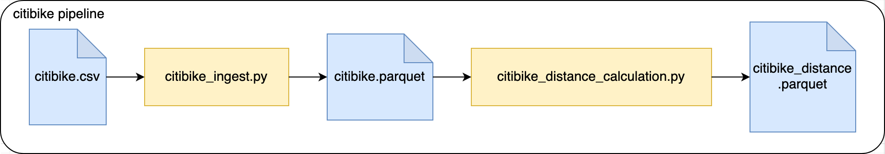

# Data transformations with Python
This is a collection of _Python_ jobs that are supposed to transform data.
These jobs are using _PySpark_ to process larger volumes of data and are supposed to run on a _Spark_ cluster (via `spark-submit`).

## Pre-requisites
Please make sure you have the following installed and can run them
* Python (3.9 or later), you can use for example [pyenv](https://github.com/pyenv/pyenv#installation) to manage your python versions locally
* [Poetry](https://python-poetry.org/docs/#installation)
* Java (11)

## Install all dependencies
```bash
poetry install
```

## Setup
### Run tests

#### Run unit tests
```bash
poetry run pytest tests/unit
```

#### Run integration tests
```bash
poetry run pytest tests/integration
```

#### Run style checks
```bash
poetry run mypy --ignore-missing-imports --disallow-untyped-calls --disallow-untyped-defs --disallow-incomplete-defs \
            data_transformations tests

poetry run pylint data_transformations tests
```
This is running the linter and a type checker.

## Create package
This will create a `tar.gz` and a `.wheel` in `dist/` folder:
```bash
# Install pre-requisites needed by batect
# For mac users:
./go.sh install-with-docker-desktop
OR
./go.sh install-with-colima

# For windows/linux users:
# Please ensure Docker and java >=8 is installed
scripts\install_choco.ps1
scripts\install.bat

# For local laptop setup ensure that Java 11 with Spark 3.2.1 is available. More details in README-LOCAL.md
```
More: https://python-poetry.org/docs/cli/#build

## Jobs

There are two applications in this repo: Word Count, and Citibike.

Currently, these exist as skeletons, and have some initial test cases which are defined but ignored.
For each application, please un-ignore the tests and implement the missing logic.

### Word Count
A NLP model is dependent on a specific input file. This job is supposed to preprocess a given text file to produce this
input file for the NLP model (feature engineering). This job will count the occurrences of a word within the given text
file (corpus). 

There is a dump of the datalake for this under `resources/word_count/words.txt` with a text file.

#### Input
Simple `*.txt` file containing text.

#### Output
A single `*.csv` file containing data similar to:
```csv
"word","count"
"a","3"
"an","5"
...
```

#### Run the job
Please make sure to package the code before submitting the spark job (`poetry build`)
```bash
poetry run spark-submit \
    --master local \
    --py-files dist/data_transformations-*.whl \
    jobs/word_count.py \
    <INPUT_FILE_PATH> \
    <OUTPUT_PATH>
```

### Citibike

**_This problem uses data made publicly available by [Citibike](https://citibikenyc.com/), a New York based bike share company._**

For analytics purposes, the BI department of a hypothetical bike share company would like to present dashboards, displaying the
distance each bike was driven. There is a `*.csv` file that contains historical data of previous bike rides. This input
file needs to be processed in multiple steps. There is a pipeline running these jobs.



There is a dump of the datalake for this under `resources/citibike/citibike.csv` with historical data.

#### Ingest

Reads a `*.csv` file and transforms it to parquet format. The column names will be sanitized (whitespaces replaced).

##### Input

Historical bike ride `*.csv` file:

```csv
"tripduration","starttime","stoptime","start station id","start station name","start station latitude",...
364,"2017-07-01 00:00:00","2017-07-01 00:06:05",539,"Metropolitan Ave & Bedford Ave",40.71534825,...
...
```

##### Output

`*.parquet` files containing the same content

```csv
"tripduration","starttime","stoptime","start_station_id","start_station_name","start_station_latitude",...
364,"2017-07-01 00:00:00","2017-07-01 00:06:05",539,"Metropolitan Ave & Bedford Ave",40.71534825,...
...
```

##### Run the job
Please make sure to package the code before submitting the spark job (`poetry build`)
```bash
poetry run spark-submit \
    --master local \
    --py-files dist/data_transformations-*.whl \
    jobs/citibike_ingest.py \
    <INPUT_FILE_PATH> \
    <OUTPUT_PATH>
```

#### Distance calculation

This job takes bike trip information and calculates the "as the crow flies" distance traveled for each trip.
It reads the previously ingested data parquet files.

Hint:

- For distance calculation, consider using [**Harvesine formula**](https://en.wikipedia.org/wiki/Haversine_formula) as an option.

##### Input

Historical bike ride `*.parquet` files

```csv
"tripduration",...
364,...
...
```

##### Outputs

`*.parquet` files containing historical data with distance column containing the calculated distance.

```csv
"tripduration",...,"distance"
364,...,1.34
...
```

##### Run the job
Please make sure to package the code before submitting the spark job (`poetry build`)
```bash
poetry run spark-submit \
    --master local \
    --py-files dist/data_transformations-*.whl \
    jobs/citibike_distance_calculation.py \
    <INPUT_PATH> \
    <OUTPUT_PATH>
```

## Running the code inside container

If you would like to run the code in Docker, please follow instructions [here](README-DOCKER.md).

## Running the code on Gitpod

Alternatively, you can setup the environment using

[](https://gitpod.io/#https://github.com/techops-recsys-lateral-hiring/dataengineer-transformations-python)

It's recommend that you setup ssh to Gitpod so that you can use VS Code from local to remote to Gitpod.

There's an initialize script setup that takes around 3 minutes to complete. Once you use paste this repository link in new Workspace, please wait until the packages are installed. After everything is setup, select Poetry's environment by clicking on thumbs up icon and navigate to Testing tab and hit refresh icon to discover tests.

### Common issue with VS Code's Testing

If Testing tab complains about Python Interpreter, run `poetry shell` in terminal to get the bin path, replace activate with python3 to resolve the issue.

If poetry shell activate with this path

`/workspace/.pyenv_mirror/poetry/virtualenvs/{project_name}-py{python_version}/bin/activate`

Paste this into Python Interpreter prompt

`/workspace/.pyenv_mirror/poetry/virtualenvs/{project_name}-py{python_version}/bin/python3`
